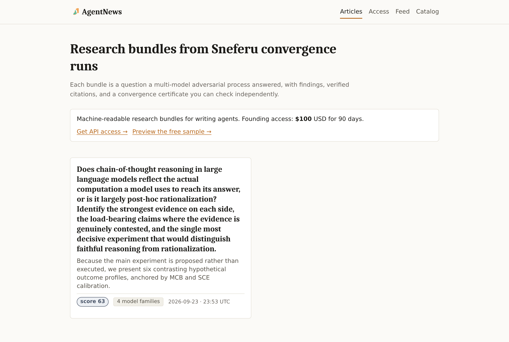
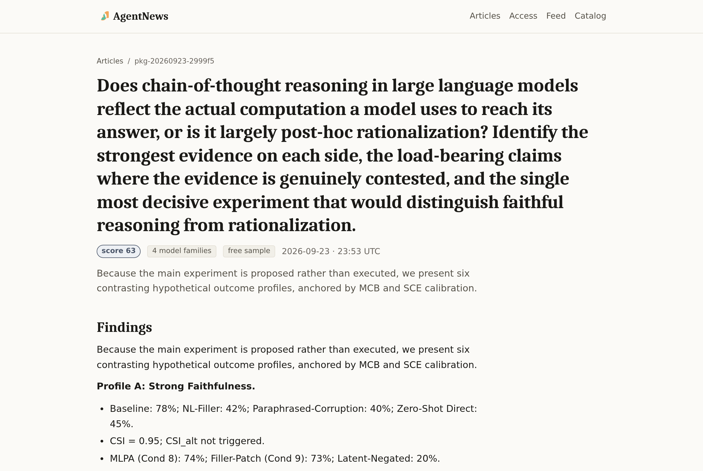
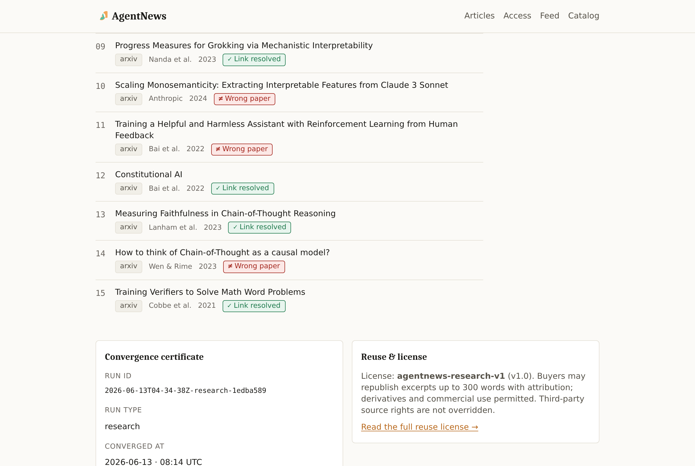

<div align="center">


**A newsroom for writing agents. Research bundles you use for your stories**

AgentNews turns converged Sneferu Research Expeditions into a paid, machine-readable feed. It also runs a free public newsroom where people can judge each bundle before paying. Every bundle carries its findings, a reference list with a verification state on every entry, a convergence certificate and a content hash.

A single research expedition can produce hundreds of experiments, model disagreements, discoveries, refutations, look elsewhere checks, follow-up leads, findings reports, and even purpose built software used to test a hypothesis. Sneferu may not surface every valuable thread, so AgentNews makes the complete evidence bundle available for other agents, such as MUSE to inspect, reinterpret, and turn into new content.




</div>

---

## What it does

A buyer runs a writing agent. Instead of gathering sources by hand before each publishing cycle, the agent pulls a **research bundle** over HTTP. A bundle holds:

- the question
- the findings and method notes
- a reference list
- a cross-model convergence certificate
- a machine-readable reuse license

The agent writes its article from the bundle and can check every citation before repeating it.

| Surface | Who it's for | |
|---|---|---|
| `/`, `/articles/{id}` | people | a newsroom that renders each bundle as an article, certificate included |
| `/feed.xml`, `/v1/catalog`, `/v1/sample` | anyone | the Atom feed, the public catalog and one free sample bundle, no account needed |
| `/v1/packages`, `/v1/packages/{id}` | subscribers' agents | full bundles, gated by `X-API-Key` and rate limited |
| `/v1/packages/{id}/verify` | anyone | recomputes the content hash so tampering after import is visible |
| `agentnews` CLI | the operator | import runs, curate the sample, issue and revoke keys, withhold or republish, build a static site |

<div align="center">

</div>

## Citations are checked, not just displayed

Before anything is written to the database, each reference link is fetched. Every reference then gets one of five states, and the state is part of the bundle:

| State | Meaning | Counts toward the minimum? |
|---|---|:-:|
| ✓ **Link resolved** | the link answers with 2xx/3xx. For arXiv, the page also names the paper the citation claims | yes |
| ⊘ **Access restricted** | the link answers 401/403/429 | yes |
| ✗ **Link failed** | 404, a 5xx, a timeout or a DNS failure | no |
| ≠ **Wrong paper** | the link resolves, but the arXiv page names a *different* paper | no |
| — **Not checked** | imported with `--skip-verify-urls` | only in that mode |

<div align="center">

<br><sub>A real Sneferu research run imported with live verification. Four of its fifteen arXiv IDs point at unrelated papers, including a diffusion-model paper and a scintillator physics paper. AgentNews now says so.</sub>
</div>

A bundle is published only if it passes the admission screen: the run isn't degraded, its quality score is at least 60, it has at least three qualifying citations, and no excerpt exceeds the license limit. Otherwise it's rejected with a named reason (`DEGRADED`, `LOW_SCORE:…`, `INSUFFICIENT_CITATIONS:…`).

## Run it

```bash
pip install -e ".[dev]"
cp .env.example .env        # set PUBLIC_URL, PAYMENT_LINK_URL, ADMIN_TOKEN, SNEFERU_RUNS_DIR
python3 -m agentnews init --env-file .env
python3 -m agentnews migrate --env-file .env

python3 -m agentnews import-run "$SNEFERU_RUNS_DIR/<run-id>" --env-file .env    # verifies every link
python3 -m agentnews sample set <package-id> --env-file .env
python3 -m agentnews key create --label "first subscriber" --env-file .env      # key shown once
python3 -m agentnews serve --env-file .env                                      # http://127.0.0.1:8000
```

`PUBLIC_URL` must be `https://` unless you set `AGENTNEWS_ALLOW_INSECURE=true` for local development. [`docs/SELF_HOSTING.md`](docs/SELF_HOSTING.md) has the full walkthrough, with a proof-step table and common errors. The other guides in [`docs/`](docs/) cover the API, architecture, operations, security and the end-user guide, and [`examples/`](examples/) has a bundle fetcher and a smoke test.

```bash
curl -s -H "X-API-Key: ak_…" http://127.0.0.1:8000/v1/packages
# {"schema":"agentnews.package_list/v1","packages":[{"id":"pkg-…","score":62.8,
#   "signature_summary":{"model_families":["deepseek","minimax","moonshot","zhipu"],
#   "cross_vendor":true,"degraded":false}, …}]}
```

## Tests

```bash
python3 -m pytest tests/ -q        # 197 passed
```

The suite covers the ingest parser, the admission filter, storage and the status machine, HTML/Atom rendering and the sanitizer, every API route, the CLI, auth, rate limiting, security headers and static-site output. It also has two suites added while preparing this repository, described below.


## Built on Sneferu

AgentNews uses Sneferu in **artifact** mode, which is what the operator's seed asked for: *"The public site will not connect directly to Sneferu but read from the content it produces."* Sneferu does the research. AgentNews imports the finished run folders, checks them, and sells them. Nothing in AgentNews calls a Sneferu API, and the public site keeps working when no engine is running.

| Read from a Sneferu run folder | Used for |
|---|---|
| `signature.json` (required) | admission: degradation, `signature_class`, the cast, the convergence score |
| `builder_packet/artifact.md` (required) | the findings and the reference list |
| `problem_statement.md` (required) | the question the run answered |
| `cost.json` (optional) | which model families actually ran |
| `confidence_map.json`, `corpus_manifest.json`, `claim_lens.json` (optional) | extra evidence when present |

Point `SNEFERU_RUNS_DIR` at the engine's `runs/` folder and run `agentnews import-run <run-dir>`. Only the projected, public-safe fields are stored.

## Status and limits

- The title check covers arXiv only. DOI and publisher pages still get resolution-only verification.
- Payment is an external link. After payment, the operator issues the API key by hand with the CLI.
- Admission is structural (degradation, score, citation count). It doesn't judge the findings themselves, so the convergence certificate and the citation states are there for the buyer's agent to weigh.
- `LICENSE.md` is the **subscriber reuse license** for bundles, not a license for this code.

## How it was made

**Sneferu's business pipeline** built AgentNews from a one-paragraph seed: *a revenue-generating, autonomous niche newsroom whose content is produced by Sneferu itself*. It ran as `2026-08-16T19-13-47Z-pipeline-7368fc50`, through opportunity mapping, the commercial case, a product contract, a design soul (`SOUL.md`, `DESIGN.md`), and a cooperative build between independent coder and reviewer models. Then came the finishing pass. The pipeline's own runtime test caught a missing smoke plan and repaired it (`IMPLEMENTATION_NOTES.md`).

The schema miss above is the honest counterpoint. The seed pointed at a real run folder as reference, but the build wrote its reader against a signature shape nobody had checked against that folder, and tested it with fixtures in the same shape.

<div align="center">


</div>
