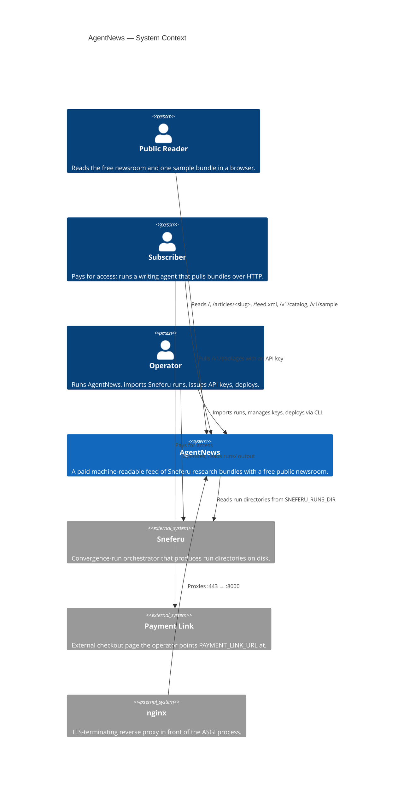
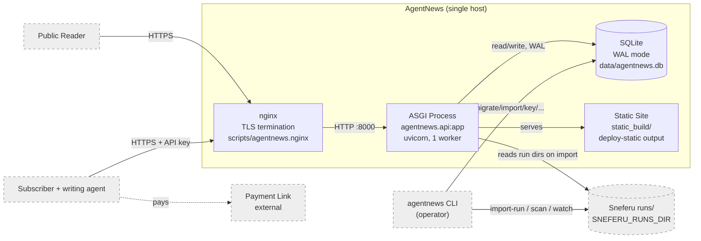
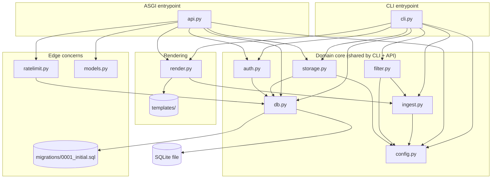
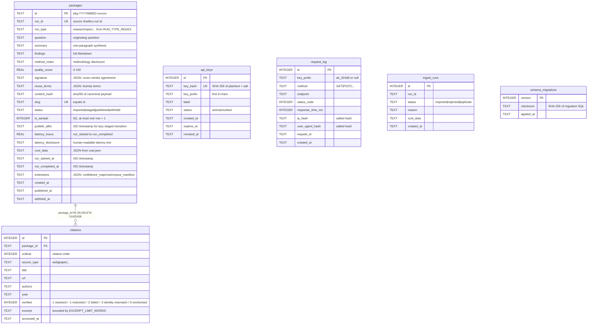
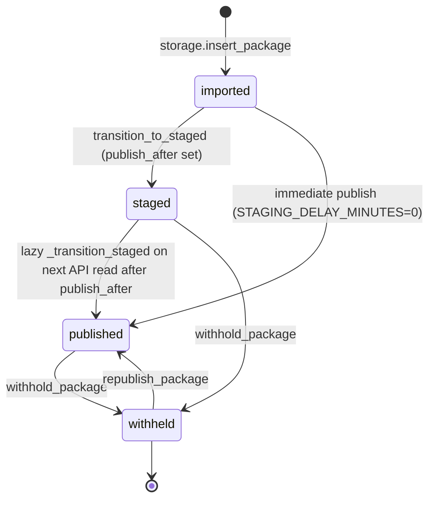

# ARCHITECTURE.md — AgentNews system design

Audience: an engineer who needs to understand how AgentNews fits together.
For using the product see [`USER_GUIDE.md`](USER_GUIDE.md); for the HTTP/CLI
interface see [`API.md`](API.md); for running it see
[`OPERATIONS.md`](OPERATIONS.md); for building and testing see
[`DEVELOPMENT.md`](DEVELOPMENT.md); for the security posture see
[`SECURITY.md`](SECURITY.md).

---

## 1. Project shape

AgentNews is a **single-process Python ASGI service with a CLI co-located in
the same package**. There is no separate worker, no message queue, no external
cache, and no frontend build step.

- **API/CLI library hybrid.** The `agentnews` package ships both the ASGI app
  (`agentnews.api:app`, FastAPI on Starlette) and a 19-top-level-subcommand CLI
  (`agentnews` console script). They share the same `config`, `db`,
  `storage`, `ingest`, `filter`, `auth`, `ratelimit`, and `render` modules.
- **Datastore: SQLite (WAL mode).** One file, default `./data/agentnews.db`.
  No external database server.
- **Templates: server-rendered Jinja2.** No client JavaScript. The HTML
  surface is generated per-request from templates; `deploy-static` can also
  emit a frozen static site to disk.
- **Distribution: a wheel + a systemd unit + an nginx reverse proxy.**
  `scripts/deploy.sh` builds the wheel, installs it into a venv, runs
  migrations, regenerates the static site, and restarts the unit.

## 2. Main components and responsibilities

```
src/agentnews/
  config.py      — env + .env loading, Config dataclass, URL normalization, env validation
  db.py          — SQLite connection pragmas, forward-only migrations, PID file, retry_on_lock
  models.py      — Pydantic v2 response models (the API contract)
  ingest.py      — Sneferu run-directory parser → ParsedRun/ParsedCitation
  filter.py      — URL verification (pre-transaction) + 4-state admission screen
  storage.py     — ingest→DB bridge, package status machine, slug, content hash, API-key store
  render.py      — stdlib Markdown renderer + allowlist HTML sanitizer + Jinja2 templates
  auth.py        — API key generation, SHA-256 hashing, in-memory validation cache
  ratelimit.py   — per-key + per-IP rolling-window rate limiting (in-memory, warmed from log)
  api.py         — FastAPI app: 12 routes, lifespan, middleware, auth, exception handlers
  cli.py         — 19 top-level subcommands argparse CLI (init…purge-logs)
  migrations/    — forward-only SQL migrations with SHA-256 checksums
  templates/     — Jinja2 HTML + Atom XML templates (no JS)
  static/        — CSS, SVG mark, reuse-license-v1.md, preview-bootstrap.js (unused by core pages)
```

| Component | Responsibility |
|-----------|----------------|
| `ingest.py` | Read a Sneferu run directory, validate required files, parse YAML front-matter, extract question/summary/findings/method_notes/citations, parse `signature.json`/`cost.json`/`corpus_manifest.json`, compute `run_type` from the run_id via `RUN_TYPE_REGEX`, compute the canonical `content_hash`. |
| `filter.py` | Run the 5-state URL verification (`1` resolved / `-1` restricted / `-2` failed / `-3` resolves to a different paper / `0` unchecked) **before any DB write**, then apply admission checks (a) not degraded, (b) score ≥ threshold, (c) qualifying citations ≥ minimum, (d) no excerpt overflow). Returns `(admitted, reject_codes)`. |
| `storage.py` | Insert a `ParsedRun` as `imported`, generate collision-retried package IDs (`pkg-YYYYMMDD-xxxxxx`), enforce slug uniqueness, manage the status machine (`imported → staged → published`, plus `withheld`), mark/replace the single sample, store/revoke/list API keys, recompute content hashes for tamper detection, list packages with status filters. |
| `db.py` | Open every connection with `WAL`, `busy_timeout=5000`, `foreign_keys=ON`. Run forward-only migrations wrapped in `BEGIN/COMMIT` with per-file SHA-256 checksums. Write a PID file at `<db>.pid`. `retry_on_lock` wraps write callables. |
| `auth.py` | Generate keys (`ak_` + 32 hex), SHA-256 hash with the stored salt, validate against the `api_keys` table, cache results in-memory with a TTL, honor `revoked` and `expires_at`. |
| `ratelimit.py` | Rolling 24h window per API-key prefix, per-IP for `/v1/sample` (10/day) and `/v1/catalog` (60/day), plus a secondary per-User-Agent-hash cap on `/v1/sample`. State is in-memory deques, warmed from `request_log` on startup. |
| `render.py` | A self-contained Markdown renderer and HTML sanitizer (stdlib only, because `markdown`/`bleach` are not assumed available). Allowlist: tags `p h1-h6 ul ol li a strong em code pre blockquote`; attributes `a[href] a[rel]`; external links gain `rel="noopener noreferrer"`. Renders the index, article, access, 404, 503, and Atom feed templates. |
| `api.py` | The ASGI app. Lifespan owns config load + env validation, DB connect + migrations, rate-limiter warm, PID file. Middleware owns security headers, request timeout, request logging (writes `request_log`), ETag generation. Auth via `require_api_key` dependency. |
| `cli.py` | Every operator action that is not an HTTP read: import, curate, key management, static-site generation, backup/restore, reports, log retention, watch. Admin operations require `ADMIN_TOKEN`. |

## 3. C4 Context diagram



## 4. C4 Container diagram



## 5. Component / module diagram



## 6. Primary flow sequence — import a run, then a subscriber fetches it

```mermaid
sequenceDiagram
    autonumber
    participant Op as Operator (CLI)
    participant Ingest as ingest.py
    participant Filt as filter.py
    participant Stor as storage.py
    participant DB as SQLite (WAL)
    participant API as api.py
    participant Sub as Subscriber agent

    Op->>Ingest: import-run <run_dir> --skip-verify-urls
    Ingest->>Ingest: read signature.json, artifact.md, problem_statement.md
    Ingest->>Ingest: parse question/findings/citations; compute content_hash
    Ingest-->>Filt: ParsedRun
    Filt->>Filt: verify URLs (4-state) — pre-transaction
    Filt->>Filt: admit(): not degraded, score >= 60, citations >= 3, excerpt OK
    alt REJECT
        Filt-->>Op: REJECT:<code> (exit 3) [--force bypasses, needs ADMIN_TOKEN]
    else ADMIT
        Stor->>DB: BEGIN; insert package (status=imported) + citations; COMMIT
        Stor-->>Op: imported pid=pkg-... status=published [when STAGING_DELAY_MINUTES=0]
    end

    Note over DB: package is now published; lazy staged-transition runs on next API read

    Sub->>API: GET /v1/packages (X-API-Key: ak_…)
    API->>Auth: validate_key (cache or DB)
    API->>Ratelimit: allow_key(prefix)
    API->>Stor: list_packages(status=published)
    Stor->>DB: SELECT packages ...
    API-->>Sub: 200 PackageList (ETag, X-Request-Id, security headers)

    Sub->>API: GET /v1/packages/<pid> (X-API-Key: ak_…)
    API->>Stor: get_package + get_citations
    API-->>Sub: 200 PackageFull (findings, citations, signature, reuse_terms)

    Sub->>API: GET /v1/packages/<pid>/verify (no key)
    API->>Stor: recompute_content_hash
    Stor->>DB: read stored hash; recompute from canonical payload
    API-->>Sub: 200 VerifyOut {match: true}
```

## 7. Data / entity diagram



> **Note:** `api_keys`, `request_log`, `ingest_runs`, and `schema_migrations` have no
> foreign key to `packages`. `citations.package_id` is the only FK (with `ON DELETE
> CASCADE`). `ingest_runs` records import attempts by `run_id` (the source Sneferu run
> id), not by `package_id`.

### Package status machine



## 8. Key design decisions

1. **URL verification is a pre-transaction phase.** `filter.admit()` runs all
   HTTP URL verification (up to 60s total) **before** any DB write, so the
   write transaction itself stays under ~2s. This eliminates SQLite lock
   contention during imports (the reframing the spec calls out explicitly).
   Source: `src/agentnews/filter.py:78`.

2. **Four-state `verified` model.** A citation is not simply "verified or
   not." `1` resolved, `-1` restricted/bot-blocked, `-2` failed, `-3` identity mismatch (arXiv page names a different paper), `0` unchecked.
   Both `1` and `-1` count toward `CITATION_MINIMUM` — a paywalled source that
   returns 403 is still a real citation, just inaccessible to an automated
   checker. Source: `src/agentnews/filter.py:6-12`.

3. **SQLite, not Postgres.** Single-operator product, single host, low write
   concurrency. WAL + `busy_timeout=5000` + `retry_on_lock` handle the
   contention that does exist (concurrent reads during an import). The PID
   file at `<db>.pid` denotes the live writer. Source: `src/agentnews/db.py`.

4. **No client JavaScript.** Every HTML page is server-rendered from real
   data/config. The sanitizer allowlist (`render.py`) is exactly the spec set;
   `script-src 'none'` is in the CSP. There is a `preview-bootstrap.js` in
   `static/` but the core pages do not reference it.

5. **Admin operations are CLI-only.** No admin HTTP endpoint exists. Sample
   curation, withhold/republish, key management, and `import-run --force` all
   require `ADMIN_TOKEN` and run through the CLI. The public API cannot
   mutate state. Source: `src/agentnews/cli.py` (`require_admin_token`).

6. **Forward-only migrations with checksums.** `db.run_migrations` wraps each
   SQL file in a transaction and records its SHA-256 in `schema_migrations`.
   There is no down-migration by design — rollbacks are restore-from-backup.
   Source: `src/agentnews/db.py`, `migrations/0001_initial.sql`.

7. **Content hash for tamper detection, not provenance.** The public `verify`
   endpoint recomputes `sha256` over the canonical (question, findings,
   sorted-citations, method_notes, score) payload and compares to the stored
   hash. This detects post-import alteration; it is not independent proof the
   bundle's claims are true. Source: `src/agentnews/ingest.py:compute_content_hash`,
   `src/agentnews/api.py` verify route.

8. **In-memory rate limiting, warmed from the log.** `ratelimit.RateLimiter`
   keeps deques of timestamps per key-prefix / IP / UA. On startup it walks
   `request_log` to reconstruct the current windows. A restart resets burst
   state but preserves the 24h history. Source: `src/agentnews/ratelimit.py`.

9. **Self-contained Markdown + sanitizer (stdlib only).** The `markdown` and
   `bleach` packages are not assumed available in every environment, so
   `render.py` implements a small renderer and an allowlist HTML sanitizer
   from the stdlib `html.parser`. The trade-off is explicit: narrower
   Markdown support, zero external dependency for the render path.

10. **Single sample slot.** Exactly one package may carry `is_sample=1`.
    Marking a new sample replaces the old one (`SampleLimitError` otherwise).
    The sample is the free, redacted preview at `/v1/sample`.

## 9. Deployment / runtime model

- **Local dev:** `python3 -m agentnews serve --env-file .env` runs uvicorn
  with `reload=False`, `timeout_keep_alive=30`, `timeout_graceful_shutdown=10`.
- **Production:** `scripts/agentnews.service` (systemd) runs the same uvicorn
  command as `User=agentnews`, `WorkingDirectory=/opt/agentnews`,
  `EnvironmentFile=/opt/agentnews/.env`, `Restart=on-failure`,
  `KillSignal=SIGTERM`, `TimeoutStopSec=12`. `ExecStartPost` curls
  `/healthz` to confirm boot.
- **Edge:** `scripts/agentnews.nginx` terminates TLS on 443, redirects 80→443,
  serves the static site from `/opt/agentnews/static_build` for HTML routes
  (`/`, `/articles/{slug}`, `/access`, `/static/`), and proxies `/v1/`,
  `/healthz`, and `/feed.xml` to `127.0.0.1:8000` with `keepalive 32`.
  `X-Forwarded-For` is set on proxied locations (set `TRUST_PROXY_HEADERS=true`
  so the app reads the last hop as the client IP). Security headers are set
  by the FastAPI middleware, not nginx.
- **Deploy helper:** `scripts/deploy.sh` builds the wheel (`python3 -m build`),
  force-reinstalls it into the configured venv, runs `migrate`, regenerates
  the static site with `deploy-static`, and restarts the systemd unit.
- **Static site:** `agentnews deploy-static` writes a frozen copy
  (`index.html`, `404.html`, `503.html`, `access.html`, `articles/<slug>.html`,
  `static/`) to `STATIC_OUTPUT_DIR` for CDN/hosting behind the same domain.

There is no horizontal scaling story in v1: one process, one SQLite file, one
host. The founding commercial test (ten buyers × $100 / 90 days) is within
this envelope by design.
