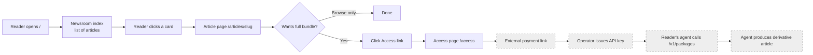

# UI.md — AgentNews web surface

Audience: a designer, operator, or reviewer evaluating the public web
surface. AgentNews has a web UI — a server-rendered, **no-JavaScript**
newsroom. For the HTTP/CLI interface see [`API.md`](API.md); for end-user
usage see [`USER_GUIDE.md`](USER_GUIDE.md).

---

## 1. Pages and routes

| Route | Template | Purpose |
|-------|----------|---------|
| `GET /` | `templates/index.html` | **Newsroom index.** Lists published research bundles as article cards. |
| `GET /articles/{slug}` | `templates/article.html` | **Article page.** Full rendering of one bundle: question, findings, references, certificate, reuse summary. `slug` equals the package id. |
| `GET /access` | `templates/access.html` | **Access / payment page.** Explains the offering, links to `PAYMENT_LINK_URL`, lists the no-key evaluation endpoints. |
| `GET /feed.xml` | `templates/feed.xml` | **Atom feed.** Latest 20 published packages. Linked from `_base.html` as `<link rel="alternate">`. |
| `GET /articles/{unknown}` | `templates/404.html` | **Not-found page.** Styled HTML 404 for unknown or withheld slugs. |
| (any, on DB unavailable) | `templates/503.html` | **Service-unavailable page.** Returned when the DB cannot be reached. |
| `GET /static/{file}` | (static) | CSS, SVG mark, reuse license, preview bootstrap. |

All pages extend `templates/_base.html`, which provides the document shell,
`<head>`, site header, footer, the Atom-feed `<link>`, and the stylesheet
link. Shared rendering helpers live in `templates/_macros.html`.

## 2. Purpose of each page

### Newsroom index (`/`)

The first URL a reader opens. Renders a chronological list of published
bundles. Each card shows the research question (as the title), a score badge,
the model families, and the publication date. Each card links to the article
page. Serves at most the latest 20 published packages.

### Article page (`/articles/{slug}`)

The human-readable rendering of a single bundle. Sections, in order:

1. **Breadcrumb** back to `/`.
2. **Header** — question as `h1`, score badge, package chips (sample status,
   latency disclosure), publication date.
3. **Summary** (if present) — one-paragraph synthesis.
4. **Findings** — the full Markdown findings, rendered through the stdlib
   renderer and the allowlist sanitizer.
5. **Methodology** — the method-notes disclosure.
6. **References** — the citation list with verification badges and external
   links (`rel="noopener noreferrer"`).
7. **Agreement certificate** — the cross-vendor signature summary (model
   families, `cross_vendor` flag, `degraded` flag, convergence score,
   timestamps).
8. **Reuse summary** — the machine-readable license terms in human form.

An unknown or withheld slug returns the styled 404 page.

### Access page (`/access`)

The conversion page. It explains what the paid API offers, links to the
external payment page (`PAYMENT_LINK_URL`), and lists the no-key evaluation
endpoints a prospective buyer can try immediately:

- `/v1/catalog` — browse the public catalog
- `/v1/sample` — preview the free sample bundle
- `/v1/openapi.json` — read the OpenAPI schema
- `/static/reuse-license-v1.md` — read the reuse license

## 3. Key components (macros)

Defined in `src/agentnews/templates/_macros.html`, used across pages:

| Macro | Renders |
|-------|---------|
| `date_label(iso)` | An ISO 8601 timestamp as a human date (`<time datetime>`). Empty string for missing input. |
| `score_badge(score)` | Tiered score pill: `>=80` high (amber), `60–79` neutral, `<60` low (muted). "score n/a" when null. |
| `prose(markdown_text)` | Markdown → allowlist HTML via `render.render_markdown`. |
| `citation_list(citations)` | Ordered reference list with per-citation `verified` badge. |
| `certificate(signature)` | The cross-vendor agreement certificate block. |
| `reuse_summary(terms)` | Human-readable reuse-license summary. |
| `package_chips(pkg)` | Sample status + latency disclosure chips. |

Every value is server-rendered from real data or config. No macro reads from
the client.

## 4. Primary user flow



The product surface (the left, solid half) is entirely the public newsroom:
`/` → `/articles/{slug}` → `/access`. The paid half (dashed) is the JSON API
documented in [`API.md`](API.md) and is not part of the HTML UI.

## 5. Loading, empty, error, and success states

AgentNews renders explicit states server-side rather than showing a blank page
or a generic error.

| State | Where | What the reader sees |
|-------|-------|----------------------|
| **Success — list populated** | `/` | Article cards for the latest 20 published bundles. |
| **Empty — no packages published** | `/` | The index renders with an empty list section and an explanatory line; no "broken" appearance. |
| **Success — article** | `/articles/{slug}` | The full article with findings, references, certificate. |
| **Empty — article missing sample/data** | `/articles/{slug}` | A given section (e.g. summary) is omitted if the field is absent; the page still renders. |
| **Error — unknown slug** | `/articles/{unknown}` | A styled 404 HTML page with a link back to `/`. HTTP 404. |
| **Error — DB unavailable** | any HTML route | A styled 503 HTML page. HTTP 503. |
| **Error — API not-found** | `/v1/...` | A flat JSON `{"error":{"code":"not_found",...}}` body. See [`API.md`](API.md) §3. |
| **Error — rate limited** | rate-limited JSON routes | A 429 JSON body with a `Retry-After` header. |
| **Success — feed** | `/feed.xml` | A valid Atom XML document. Empty `<feed>` with a current `<updated>` when no packages are published. |

## 6. Design system

A full design specification lives in [`../DESIGN.md`](../DESIGN.md) (the build
brief) and the brand identity in
[`../BRAND_IDENTITY.md`](../BRAND_IDENTITY.md). The implemented surface follows
it:

- **No JavaScript.** `Content-Security-Policy: script-src 'none'`. Every value
  is server-rendered. (`static/preview-bootstrap.js` exists but is not
  referenced by the core pages.)
- **Stylesheet:** `static/style.css`, linked from `_base.html` as
  `/static/style.css`. Tokens chain through CSS custom properties.
- **Palette:** near-black cool slate surface, warm off-white text, a single
  amber signal for scores/links/focus, a single teal signal for independently
  confirmed items.
- **Motion:** none beyond a 120ms color crossfade.
- **Typography / layout:** measure-bounded prose column; skip-link to
  `#main` for keyboard users; `<html lang="en">`; `color-scheme: dark light`.
- **Icon:** `static/mark.svg`, served as the favicon and apple-touch-icon.

## 7. Local dev command

```bash
python3 -m agentnews serve --env-file .env
```

Then open `http://127.0.0.1:8000/`. There is no frontend build step, no
hot-reload of templates beyond restarting the process, and no package manager
for the UI. To iterate on a template, edit the file under
`src/agentnews/templates/` and restart `serve`.

To render a frozen copy of the whole site to disk:

```bash
python3 -m agentnews deploy-static --env-file .env
# writes index.html, 404.html, 503.html, access.html, articles/<slug>.html, static/
# to STATIC_OUTPUT_DIR (default ./static_build)
```

## 8. Deployment path

The HTML UI is served by the same ASGI process as the JSON API; there is no
separate frontend deployment. In production:

1. `scripts/deploy.sh` builds the wheel, installs it, runs migrations,
   regenerates the static site, and restarts the systemd unit.
2. `scripts/agentnews.nginx` terminates TLS and proxies to `127.0.0.1:8000`.
3. (Optional) the `deploy-static` output in `STATIC_OUTPUT_DIR` can be served
   directly by nginx or a CDN for the read-only newsroom, with the JSON API
   still served dynamically. The static output is a snapshot — it does not
   receive lazy staged-transition updates until regenerated.

See [`OPERATIONS.md`](OPERATIONS.md) for the full deploy procedure.
